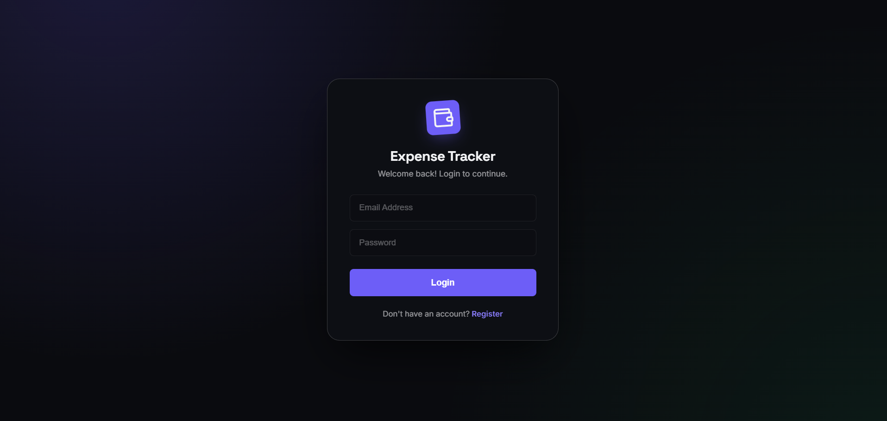
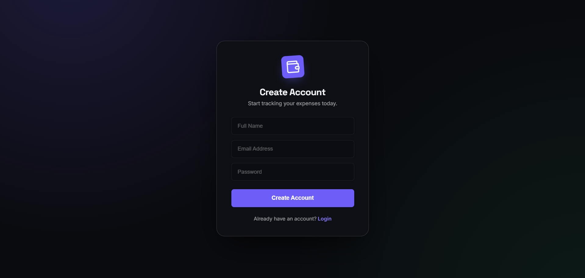
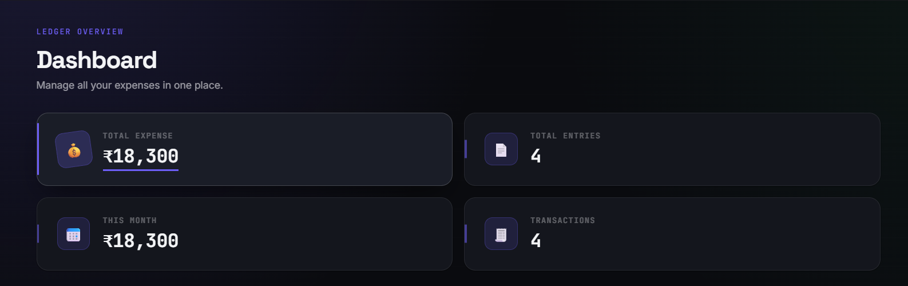
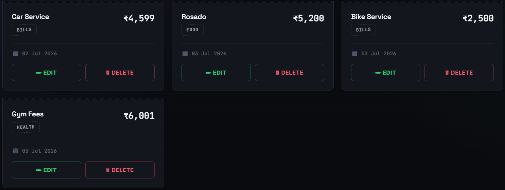
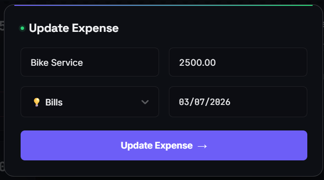
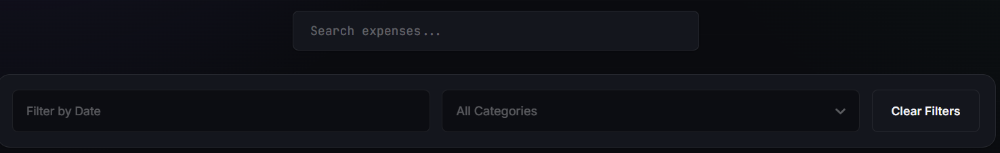
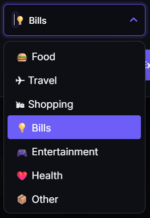
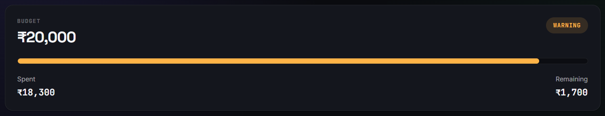
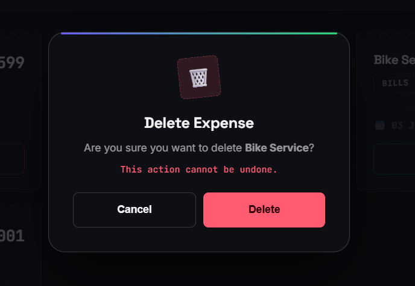

# 💰 Expense Tracker

A modern full-stack expense management application built using **React**, **Node.js**, **Express.js**, and **PostgreSQL (Neon)**.

The application enables users to securely manage daily expenses with **JWT authentication**, **advanced search & filtering**, **budget tracking**, and an elegant **Ledger-inspired dashboard** designed for a clean and intuitive user experience.

---

# 📸 Preview

## 🔐 Authentication

| Login | Register |
|-------|----------|
|  |  |

---

## 📊 Dashboard



---

## 💳 Expense Management

| Expense Cards | Update Expense |
|--------------|----------------|
|  |  |

---

## 🔍 Search & Filters

| Search & Date Filter | Category Filter |
|----------------------|-----------------|
|  |  |

---

## 💰 Budget Tracker



---

## 🗑 Delete Confirmation



---

# ✨ Features

## 🔐 Authentication

- User Registration
- User Login
- JWT Authentication
- Password Hashing using bcrypt
- Protected Routes
- Secure API Authorization

---

## 💳 Expense Management

- Add New Expense
- Update Existing Expense
- Delete Expense
- Confirmation Dialog before Delete
- Category Selection
- Date Selection

---

## 🔍 Search & Filtering

- Search by Expense Title
- Search by Category
- Filter by Date
- Filter by Category
- Clear All Filters

---

## 📊 Dashboard

- Total Expenses
- Total Entries
- Total Expenses This Month
- Monthly Transactions
- Monthly Budget Tracker
- Remaining Budget
- Budget Progress Indicator

---

## 🎨 User Experience

- Modern Ledger-inspired UI
- Fully Responsive Design
- Floating Action Button
- Toast Notifications
- Custom React Select
- Custom React DatePicker
- Smooth Animations
- Clean Confirmation Modals

---

# 🛠 Tech Stack

## Frontend

- React
- React Router DOM
- Axios
- React Select
- React DatePicker
- React Hot Toast
- CSS3

## Backend

- Node.js
- Express.js
- JWT (jsonwebtoken)
- bcrypt

## Database

- PostgreSQL
- Neon Database

## Deployment

- Frontend → Vercel
- Backend → Render
- Database → Neon

---

# 📂 Project Structure

```text
expense-tracker
│
├── backend
│   ├── config
│   ├── controllers
│   ├── middleware
│   ├── routes
│   ├── services
│   ├── package.json
│   └── server.js
│
├── frontend
│   ├── src
│   │   ├── assets
│   │   ├── components
│   │   ├── pages
│   │   ├── services
│   │   ├── App.jsx
│   │   └── main.jsx
│   └── package.json
│
├── screenshots
└── README.md
```

---

# 🚀 Getting Started

## 1️⃣ Clone the Repository

```bash
git clone https://github.com/YOUR_USERNAME/expense-tracker.git

cd expense-tracker
```

---

## 2️⃣ Install Dependencies

### Backend

```bash
cd backend

npm install
```

### Frontend

```bash
cd ../frontend

npm install
```

---

## 3️⃣ Environment Variables

Create a `.env` file inside the **backend** folder.

```env
PORT=5000

DATABASE_URL=YOUR_NEON_DATABASE_URL

JWT_SECRET=YOUR_SECRET_KEY
```

---

## 4️⃣ Run the Application

### Start Backend

```bash
cd backend

npm run dev
```

Backend runs on

```
http://localhost:5000
```

---

### Start Frontend

```bash
cd frontend

npm run dev
```

Frontend runs on

```
http://localhost:5173
```

---

# 📡 API Endpoints

## Authentication

| Method | Endpoint |
|---------|----------|
| POST | /api/auth/register |
| POST | /api/auth/login |

---

## Expenses

| Method | Endpoint |
|---------|----------|
| GET | /api/expenses |
| POST | /api/expenses |
| PUT | /api/expenses/:id |
| DELETE | /api/expenses/:id |

---

# 🚧 Upcoming Features

- 📈 Expense Analytics
- 🥧 Category Pie Chart
- 📊 Monthly Spending Chart
- 💡 Spending Insights
- 📄 Export to PDF
- 📁 Export to CSV
- ⚙ Editable Budget
- 🌙 Additional UI Improvements

---

# 🤝 Contributing

Contributions are welcome!

1. Fork the repository.
2. Create a new feature branch.
3. Commit your changes.
4. Push to your fork.
5. Open a Pull Request.

---

# 👨‍💻 Author

**Aryan Katiyar**

GitHub: https://github.com/aryankatiyar2323

LinkedIn: linkedin.com/in/aryan-katiyar-76a98a361
